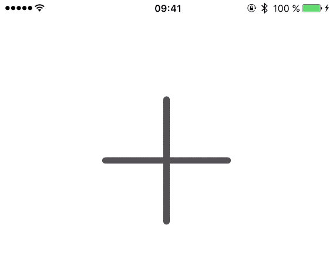
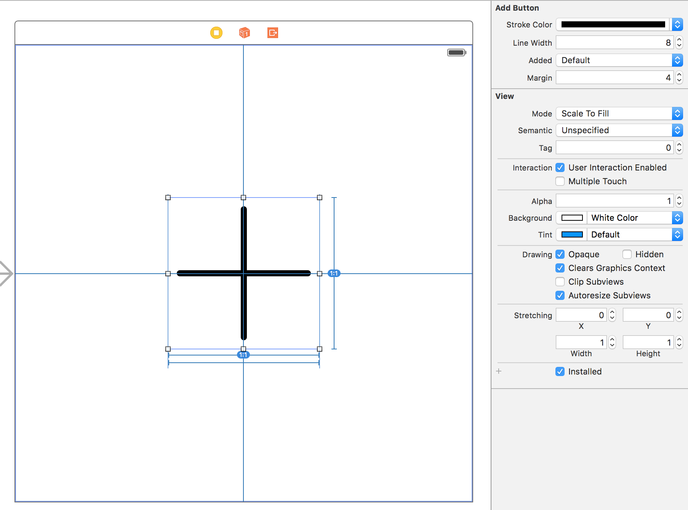

# AddButton

[](https://travis-ci.org/svenbacia/AddButton)
[](http://cocoapods.org/pods/AddButton)
[](http://cocoapods.org/pods/AddButton)
[](http://cocoapods.org/pods/AddButton)

## Description
`AddButton` is a simple button which has two states. One will display an add sign, the other a checkmark.




## Usage
To run the example project, clone the repo, and run `pod install` from the Example directory first.

### Storyboard
To use `AddButton` in your own project simply take a `UIView` object and set its class to `AddButton`. You can customize various properties directly in Interface Builder like the `strokeColor` or `lineWidth`.



### In Code
```swift
// create an AddButton and add it as a subview
let addButton = AddButton(frame: CGRect(x: 50, y: 50, width: 44, height: 44))
view.addSubview(addButton)

// add target and action
addButton.addTarget(self, action: #selector(addButtonTapped(_:)), forControlEvents: .TouchUpInside)

// change the button state when tapped
@IBAction func addButtonTapped(sender: AddButton) {
  sender.added = !sender.added
}
```

## Customizations
`AddButton` provides various customizations which can be done either in code or in Interface Builder.

```swift
/// Stroke color for the add sign.
@IBInspectable public var strokeColor: UIColor = UIColor.blackColor()

/// Line width for the add sign / checkmark.
@IBInspectable public var lineWidth: CGFloat = 2.0

/// When set to `true` the button will display a checkmark. When `false` an add sign.
@IBInspectable public var added: Bool = false

/// The additional spacing between the border of the view and the add sign / checkmark.
@IBInspectable public var margin: CGFloat = 8.0
```

Additionally there is convenience method to add a border to your button.
```swift
border(width:color:cornerRadius)
```

## Requirements

- iOS 8.0
- Swift 2.0

## Installation
AddButton is available through [CocoaPods](http://cocoapods.org). To install
it, simply add the following line to your Podfile:

```ruby
pod "AddButton"
```

## Author
Created and maintained by [@svenbacia](https://twitter.com/svenbacia)

## License

AddButton is available under the MIT license. See the [LICENSE](LICENSE) file for more info.
